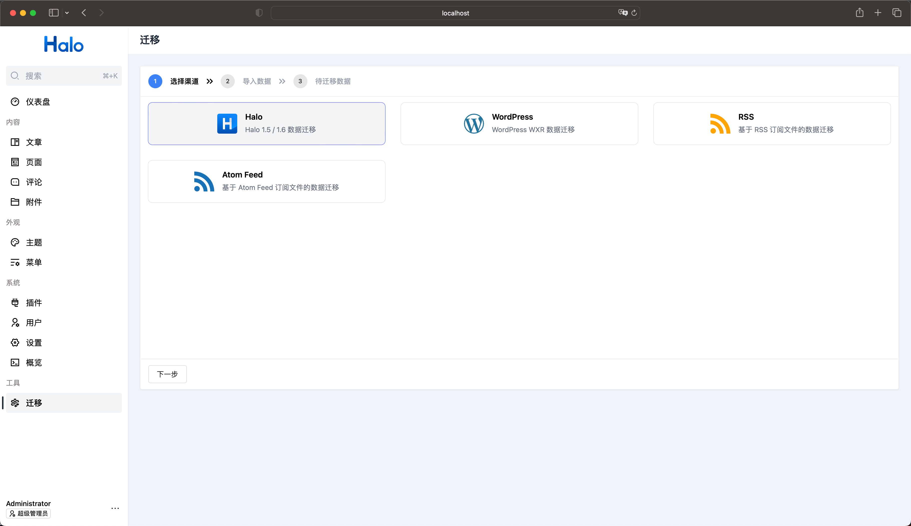

# Halo 1.x 数据迁移指引

由于 Halo 2.0 的底层架构变动，无法兼容 1.x 的数据，导致无法平滑升级，所以需要进行数据迁移。为此，我们提供了从 Halo 1.5 / 1.6 版本迁移的方案。在进行迁移之前，**有几点注意事项和要求，如果你目前无法满足，建议先暂缓迁移。**

- Halo 版本必须为 1.5.x 或 1.6.x。如果不满足，需要先升级到 1.5.x 或 1.6.x 版本。
- Halo 2.0 不兼容 1.x 的主题，建议在升级前先查询你正在使用的主题是否已经支持 2.0。你可以访问 [halo-sigs/awesome-halo](https://github.com/halo-sigs/awesome-halo) 或 [应用市场](https://halo.run/store/apps?type=THEME) 查阅目前支持的主题。
- Halo 2.0 目前没有内置 Markdown 编辑器，如果需要重新编辑迁移后的文章，需要额外安装 Markdown 编辑器插件。目前社区已经提供了以下插件：
  - StackEdit：<https://halo.run/store/apps/app-hDXMG>
  - ByteMD：<https://halo.run/store/apps/app-HTyhC>
- Halo 2.0 不再内置友情链接、日志、图库等模块，需要安装额外的插件，目前官方已提供：
  - 链接管理：<https://halo.run/store/apps/app-hfbQg>
  - 图库：<https://halo.run/store/apps/app-BmQJW>
  - 瞬间（原日志）：<https://halo.run/store/apps/app-SnwWD>
- Halo 2.0 不再内置外部云存储的支持。需要安装额外的插件，目前官方已提供：
  - S3（兼容国内主流的云存储）：<https://halo.run/store/apps/app-Qxhpp>
  - 阿里云 OSS：<https://halo.run/store/apps/app-wCJCD>
- 在迁移过程中不会保留旧版本的用户数据，迁移完成之后，关于文章等数据的关联都将改为 Halo 2.0 的新用户。
- 为了防止直接升级 2.0 导致 1.x 的数据受到破坏，我们已经将工作目录由 `~/.halo` 变更为 `~/.halo2`。
- 目前 Halo 2.0 仅提供 Docker 部署方式，没有提供可执行 JAR 包，但可以自编译，请参考 [构建](../developer-guide/core/build.md) 文档
- 可以考虑先在本地运行一个 Halo 2.0，模拟一下导入，检查导入后是否满足要求。

如果遇到了迁移过程中的问题，也可以向我们提交 Issue: <https://github.com/halo-dev/halo/issues/new/choose>，以上暂不支持的功能我们也会陆续完善。

## 备份数据

在进行迁移操作之前，我们强烈建议先**完整备份所有数据**，可以参考 [备份迁移](https://docs.halo.run/user-guide/backup-migration) 进行整站备份。

## 导出数据文件

在 Halo 1.5.x / 1.6.x 后台的小工具中提供了数据导出的功能，将最新的数据进行备份，然后下载即可。这个数据文件包含了数据库所有的数据，后续我们在 2.0 的导入插件中就是通过这个文件进行数据导入。

## 移动附件

- 本地存储的附件，只需要将 1.x 工作目录的 `upload` 目录里面的所有文件夹移动到 2.0 工作目录下的 `attachments/migrate-from-1.x` 文件夹即可。
- 云存储的附件迁移会在迁移过程中进行。

## 安装插件

在迁移过程中，需要提前安装必要的插件：

- 链接管理：<https://halo.run/store/apps/app-hfbQg>
- 图库：<https://halo.run/store/apps/app-BmQJW>
- 瞬间（原日志）：<https://halo.run/store/apps/app-SnwWD>
- S3（如果需要迁移存在云存储的附件，需要安装）：<https://halo.run/store/apps/app-Qxhpp>

## 配置存储策略（可选）

> 如果在 Halo 1.x 中未使用云存储，可以跳过此步骤。

1. 安装 S3 插件。
2. 进入附件管理页面。
3. 点击页面右上角的 **存储策略** 按钮。
4. 创建存储策略，选择 **S3 Object Storage**。
5. 填写相关配置，点击 **保存** 即可。

## 迁移

1. 点击左侧菜单的迁移进入迁移页面。
2. 在选择渠道步骤中，选择 **Halo**，点击下一步。
   

3. 在导入数据步骤中，点击 **选择文件** 按钮，选择在 Halo 1.5.x / 1.6.x 导出的数据文件（JSON 格式），之后点击下一步。
4. 如果存在需要迁移的附件，则会出现 **设置附件存储策略** 步骤，此时选择之前创建的存储策略即可。完成之后点击下一步。
5. 在待迁移数据步骤中，可以再次审查待迁移的数据，审查结束后点击 **执行导入** 后，耐心等待即可，数据迁移完成后会有弹窗进行提示。
